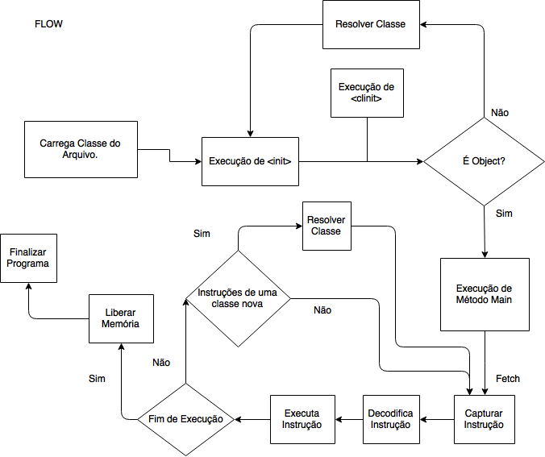
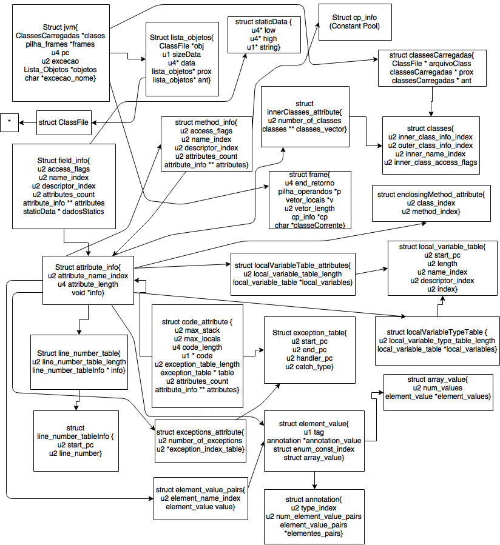

# Projeto da Máquina Virtual Java - Grupo 04

####Professor Marcelo Ladeira

####Semestre: 2017/1

####Integrantes:

* Eduardo Sousa		13/0108405

* Eduardo Schuabb		11/0010876

* Maximillian Xavier	12/0153271

* Murilo Medeiros		12/0130637

* Rafael Costa		12/0133253

##Especificação

Esse trabalho foi realizado com base nas aulas e nos materiais do professor Marcelo Ladeira. A JVM (Java Virtual Machine), foi construída com base na parte anterior, que foi a construção do leitor e exibidor de um arquivo .class. A partir desse leitor, que possui as estruturas de uma classe já carregada, foi possivel montar as estruturas de run-time e dessa forma, a construção da JVM.

##Executando o programa

Para compilar os arquivos, é possivel executar o makefile com o comando

> make

Ou via compilação manual rodando o comando

> gcc -std=c99 -Wall structures.h lista_operandos.h pilha_operandos.h interpretador.h lista_frames.h pilha_frames.h classFileStruct.h instrucoes.h leitura.h lista_classes.h jvm.h lista_operandos.c pilha_operandos.c interpretador.c lista_frames.c pilha_frames.c instrucoes.c leitura.c lista_classes.c jvm.c main.c -lm

Será gerado um arquivo executável (a.out em Linux, a.exe em Windows) que deve ser rodado passando um arquivo 
".class" como no exemplo:

> ./a.out Main.class

O usuario deve inserir o nome do arquivo de saida quando requisitado pelo programa. 
O programa imprime a saída na tela e neste arquivo.

##Projeto lógico da JVM

##Diagrama de estruturas utilizadas

